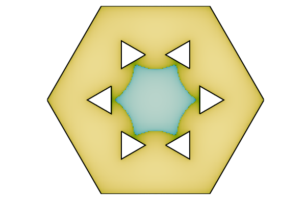

# A counterexample to Payne's nodal line conjecture with few holes



This repository contains the code for the computer assisted parts of
the proofs for the paper [A counterexample to Payne's nodal line
conjecture with few holes](https://arxiv.org/abs/2103.02276). If you
are interested in seeing the results of the computations without
running anything yourself you can look at the html-files in the
`proofs` directory. There are six files corresponding to different
parts of the proof

- [1-separating-first-four](proofs/1-separating-first-four.jl.html)
  shows the procedure for separating the first four eigenvalues from
  the rest. It corresponds to section 3 in the paper.
- [2a-approximate-eigenfunctions](proofs/2a-approximate-eigenfunctions.jl.html)
  shows the procedure for computing approximations for the first four
  eigenfunctions. It corresponds to section 4 in the paper.
- [2b-approximate-eigenfunctions-plots](proofs/2b-approximate-eigenfunctions-plots.jl.html)
  contains some plots of the approximate eigenfunctions.
- [3-isolating-second](proofs/3-isolating-second.jl.html) shows the
  procedure for isolating the second eigenfunction. It corresponds to
  section 5 in the paper
- [4a-isolating-nodal-line-exploration](proofs/4a-isolating-nodal-line-exploration.jl.html)
  shows the procedure for determining Γ used in proving that the nodal
  line is closed.
- [4a-isolating-nodal-line-exploration](proofs/4a-isolating-nodal-line-exploration.jl.html)
  shows the procedure for proving that the nodal line is closed. This
  corresponds to section 6 in the paper.

You will likely have to download the files and open them locally in
your browser.

## Reproducing the proof

All the html-files mentioned above are generated from
[Pluto](https://github.com/fonsp/Pluto.jl) notebooks. You can
reproduce the proof by running the notebooks yourself as described
below.

The proofs were run with Julia version 1.6 but should likely work with
later versions as well. This repository contains the same
`Manifest.toml` file as was used when running the proofs, this will
allow us to install exactly the same versions of the packages. To do
this start by downloading this repository, enter the directory and
start Julia. Now run the code

``` julia
using Pkg
Pkg.activate(".")
Pkg.instantiate()
```

This will likely take some time the first time you run it since it has
to download all the packages. You can see if it seems to work by
running `Pkg.test()`. This should give you some output related to all
the installed packages and then ending in

```
Test Summary: | Pass  Total
PaynePolygon  |   45     45
    Testing PaynePolygon tests passed
```

To run the notebooks do

``` julia
using Pluto
Pluto.run()
```

which should open a Pluto window in your browser. Now you can open any
of the six notebooks inside the `proofs` directory through this and it
should run the proof. Notice that some of these can take several hours
to complete. The first one,
[proofs/1-separating-first-four.jl](proofs/1-separating-first-four.jl),
requires up to 32GB of memory for the full version, to run a demo
version instead you can change a flag in the beginning of the
notebook.. Normally you would have to run the notebooks in order since
the latter ones depend on data from the former ones, however the data
is stored in the repository so you should be able to run them in any
order you like (be careful with changing the notebooks and overwriting
the data).
